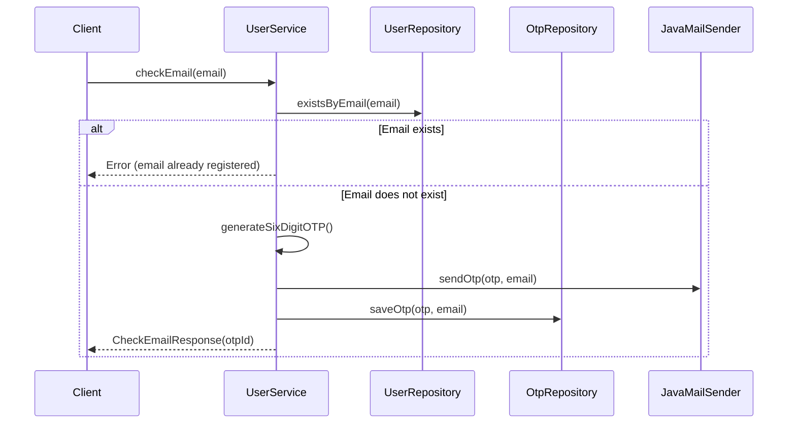
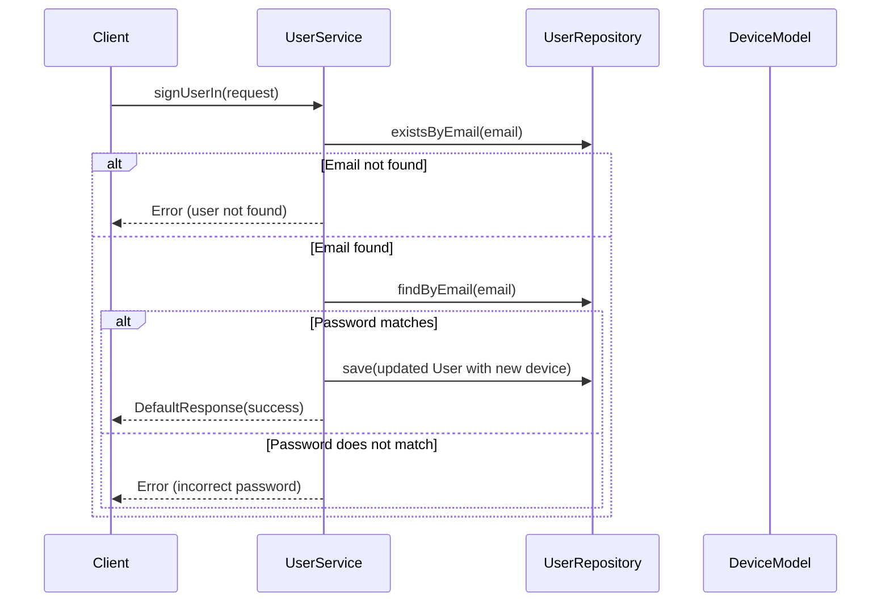

# sage-mca

# deploying

az spring app deploy \
--resource-group VisualStudioOnline-7ADA98DAA42E42A1A5CDCB2F11A79EF4 \
--service gelo-corp-m \
--name sage \
--artifact-path sage-microservices-0.0.1-SNAPSHOT.jar

# api url

https://sage.redocean-171801c3.centralus.azurecontainerapps.io

### Sequence Diagrams

